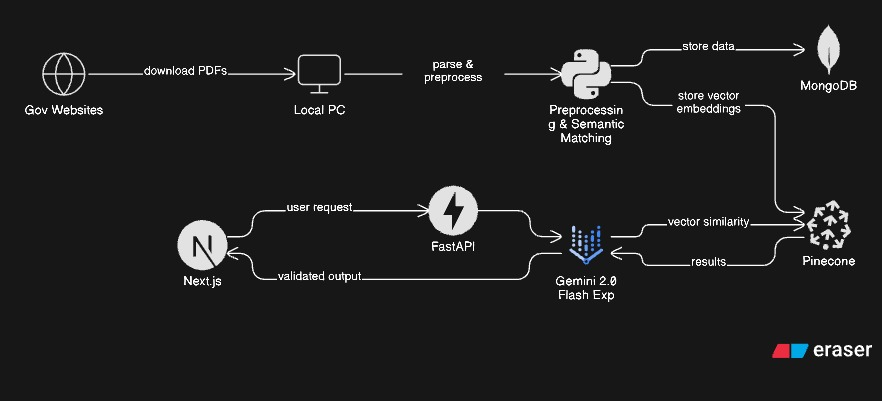

# Fairly - Domestic Worker Rights Chat Application

A modern full-stack chat application built with Next.js and FastAPI, featuring AI-powered responses using RAG (Retrieval Augmented Generation) for domestic worker rights information. The system processes government documents and provides accurate, context-aware answers based on legal regulations.

## 🎯 Features

- **AI-Powered Chat**: Intelligent responses using Google Gemini 2.0 Flash Exp and Pinecone vector search
- **RAG System**: 3-layer search engine for accurate, context-aware responses from legal documents
- **Jurisdiction-Aware**: Remembers user's jurisdiction preference across conversations
- **Modern UI**: Clean, Gemini-inspired design with customizable themes (Caffeine, Neo Brutalism) and dark/light modes
- **Full-Stack**: Complete REST API backend with MongoDB persistence
- **Type-Safe**: Full TypeScript support on frontend, Pydantic models on backend
- **No Auth Required**: Works immediately without authentication (optional auth available)
- **Document-Based**: Answers sourced from verified government documents and legal regulations

## 🏗️ System Architecture



*Architecture diagram showing data ingestion pipeline (top) and user request processing pipeline (bottom)*

Fairly uses a two-pipeline architecture: **Data Ingestion & Preprocessing** and **User Request Processing**.

### Data Ingestion Pipeline

```
Government Websites (PDFs)
    ↓
Local PC (Download & Store)
    ↓
Python Script (Preprocessing & Semantic Matching)
    ├── Parse & Preprocess PDFs
    ├── Generate Vector Embeddings
    ├── Store Data → MongoDB
    └── Store Vector Embeddings → Pinecone
```

### User Request Pipeline

```
Next.js Frontend
    ↓ (User Request)
FastAPI Backend
    ↓ (Vector Similarity Search)
Pinecone (Vector Database)
    ↓ (Retrieved Document Chunks)
Gemini 2.0 Flash Exp (AI Model)
    ↓ (Validated Output)
FastAPI Backend
    ↓ (Response)
Next.js Frontend (Display to User)
```

### RAG (Retrieval Augmented Generation) Flow

1. **User Query** → FastAPI receives user message
2. **Vector Search** → FastAPI queries Pinecone for semantically similar document chunks
3. **Context Retrieval** → Pinecone returns relevant document chunks from MongoDB
4. **AI Generation** → Gemini 2.0 Flash Exp generates response using retrieved context
5. **Validation** → Response is validated and returned to user

## 📁 Project Structure

```
HACK-RUC/
├── frontend/              # Next.js frontend application
│   ├── app/              # Next.js app router pages
│   ├── components/       # React components (UI, auth, chat)
│   ├── lib/              # API clients, contexts, types, utils
│   └── config/           # Configuration files
├── backend/              # FastAPI backend application
│   ├── api/              # FastAPI application
│   │   ├── routes/       # API endpoints (chats, messages)
│   │   ├── services/     # Business logic (chat, message, AI)
│   │   └── models.py     # Pydantic models
│   ├── search engine/    # RAG search engine (3-layer architecture)
│   ├── data-preprocessing/  # PDF parsing & preprocessing scripts
│   └── embdedding/       # Vector embedding generation scripts
└── README.md             # This file
```

## 🚀 Quick Start

### Prerequisites

- **Node.js** 18+ and npm
- **Python** 3.8+
- **MongoDB** Atlas account (or local MongoDB)
- **Google Gemini API** key
- **Pinecone** account and API key

### 1. Backend Setup

```bash
cd backend

# Install dependencies
pip install -r requirements.txt

# Configure environment variables
# Copy .env.example to .env and fill in your credentials
# Required variables:
# - MONGODB_USERNAME, MONGODB_PASSWORD, MONGODB_CLUSTER, MONGODB_APP_NAME
# - MONGODB_DATABASE, MONGODB_COLLECTION
# - GEMINI_API_KEY
# - PINECONE_API_KEY, PINECONE_INDEX_NAME
# - API_PORT, API_HOST, CORS_ORIGINS

# Create database indexes
python api/create_indexes.py

# Start the server
python run_api.py
```

The API will be available at `http://localhost:8000`
- **Swagger UI**: http://localhost:8000/docs
- **Health Check**: http://localhost:8000/health

### 2. Frontend Setup

```bash
cd frontend

# Install dependencies
npm install

# Configure environment variables (optional)
# Create .env.local with:
# NEXT_PUBLIC_API_URL=http://localhost:8000
# NEXT_PUBLIC_USE_MOCK_API=false

# Start development server
npm run dev
```

The frontend will be available at [http://localhost:3000](http://localhost:3000)

## 📚 Documentation

### Comprehensive Documentation

- **[PROJECT_DOCUMENTATION.md](PROJECT_DOCUMENTATION.md)** - Complete project documentation with detailed explanations, architecture diagrams, and setup guides

### Backend Documentation

- **[Backend README](backend/README.md)** - Complete backend API documentation
- **[Quick Start Guide](backend/QUICK_START.md)** - Get started in 3 steps
- **[Testing Guide](backend/TESTING_GUIDE.md)** - How to test the API
- **[Implementation Details](backend/IMPLEMENTATION_COMPLETE.md)** - What was built

### Frontend Documentation

- **[Frontend README](frontend/README.md)** - Complete frontend documentation
- **[Implementation Plan](frontend/IMPLEMENTATION_PLAN.md)** - Development roadmap

## 🔧 Environment Variables

### Backend (.env)

```env
# MongoDB Configuration
MONGODB_USERNAME=your_username
MONGODB_PASSWORD=your_password
MONGODB_CLUSTER=your_cluster.mongodb.net
MONGODB_APP_NAME=your_app_name
MONGODB_DATABASE=fairly
MONGODB_COLLECTION=fairly_chunks

# Google Gemini API
GEMINI_API_KEY=your_gemini_api_key
GEMINI_MODEL=gemini-2.0-flash-exp
EMBEDDING_MODEL=gemini-embedding-exp-03-07
EMBEDDING_DIMENSION=3072

# Pinecone Configuration
PINECONE_API_KEY=your_pinecone_api_key
PINECONE_INDEX_NAME=domestic-worker-rights

# Search Engine Configuration
TOP_K_RESULTS=8
SIMILARITY_THRESHOLD=0.65

# API Configuration
API_PORT=8000
API_HOST=0.0.0.0
CORS_ORIGINS=http://localhost:3000
```

### Frontend (.env.local)

```env
NEXT_PUBLIC_API_URL=http://localhost:8000
NEXT_PUBLIC_USE_MOCK_API=false
```

## 🛠️ Development

### Starting Fresh (Clear Caches)

```powershell
# Clear Python cache
Get-ChildItem -Path . -Recurse -Directory -Filter "__pycache__" | Remove-Item -Recurse -Force

# Clear Next.js cache
Remove-Item -Path "frontend\.next" -Recurse -Force -ErrorAction SilentlyContinue
```

### Backend Development

```bash
cd backend
python run_api.py          # Start with auto-reload
python test_api.py          # Run API tests
```

**Backend runs on:** `http://localhost:8000`
- Swagger UI: http://localhost:8000/docs
- Health Check: http://localhost:8000/health

### Frontend Development

```bash
cd frontend
npm run dev                 # Start development server
npm run build               # Build for production
npm run lint                # Run linter
```

**Frontend runs on:** `http://localhost:3000`

### Running Both Servers

**Terminal 1 (Backend):**
```bash
cd backend
python run_api.py
```

**Terminal 2 (Frontend):**
```bash
cd frontend
npm run dev
```

## 📡 API Endpoints

### Chat Endpoints
- `GET /api/chats` - Get all chats
- `GET /api/chats/{chat_id}` - Get specific chat
- `POST /api/chats` - Create new chat
- `PATCH /api/chats/{chat_id}` - Update chat
- `DELETE /api/chats/{chat_id}` - Delete chat

### Message Endpoints
- `GET /api/chats/{chat_id}/messages` - Get all messages
- `POST /api/chats/{chat_id}/messages` - Create message (triggers AI response)
- `PATCH /api/chats/{chat_id}/messages/{message_id}` - Update message
- `DELETE /api/chats/{chat_id}/messages/{message_id}` - Delete message

## 🧠 AI Integration & RAG System

The application uses a sophisticated 3-layer RAG (Retrieval Augmented Generation) system powered by Google Gemini 2.0 Flash Exp:

### 3-Layer Architecture

1. **Layer 1: Query Processing & Vectorization**
   - Jurisdiction detection and normalization
   - Query refinement using AI
   - Vector embedding generation (3072 dimensions)

2. **Layer 2: Vector Similarity Search**
   - Semantic search in Pinecone vector database
   - Retrieves top-k most relevant document chunks
   - Filters by jurisdiction when specified

3. **Layer 3: Response Generation**
   - Context-aware response generation using Gemini 2.0 Flash Exp
   - Validates response relevance to query
   - Returns human-readable answers based on retrieved documents

### Request Processing Flow

When a user sends a message:

1. **User Message Saved** → Stored in MongoDB immediately
2. **Jurisdiction Detection** → If message contains only jurisdiction (e.g., "US federal"), it's stored for future queries
3. **Background AI Processing** → FastAPI triggers asynchronous AI response generation
4. **Vector Search** → Pinecone searches for similar document chunks
5. **AI Generation** → Gemini generates response using retrieved context
6. **Response Saved** → Assistant message stored in MongoDB
7. **Frontend Polling** → Frontend polls for AI response (every 2 seconds)
8. **UI Update** → Response displayed when ready

### Jurisdiction Persistence

- Once a user specifies a jurisdiction (e.g., "US federal"), it's stored in the chat
- All subsequent queries in that chat automatically use the stored jurisdiction
- Users can change jurisdiction by specifying a new one
- Supports: US Federal, NY, NYC, NJ, Philadelphia

## 🧪 Testing

### Backend API Testing

```bash
cd backend
python test_api.py
```

Or use the Swagger UI at http://localhost:8000/docs for interactive testing.

### Frontend Testing

The frontend uses mock API by default. To test with real backend:
1. Set `NEXT_PUBLIC_USE_MOCK_API=false` in `.env.local`
2. Ensure backend is running on port 8000

## 🚢 Production

### Backend Production

```bash
# Using uvicorn directly
uvicorn api.main:app --host 0.0.0.0 --port 8000

# Using Gunicorn with Uvicorn workers
gunicorn api.main:app -w 4 -k uvicorn.workers.UvicornWorker --bind 0.0.0.0:8000
```

### Frontend Production

```bash
cd frontend
npm run build
npm start
```

## 🐛 Troubleshooting

### Clearing Caches

**Clear Python Cache:**
```powershell
Get-ChildItem -Path . -Recurse -Directory -Filter "__pycache__" | Remove-Item -Recurse -Force
```

**Clear Next.js Cache:**
```powershell
Remove-Item -Path "frontend\.next" -Recurse -Force -ErrorAction SilentlyContinue
```

### Backend Issues

- **MongoDB Connection**: Verify credentials in `.env` and check IP whitelist
- **Search Engine**: Verify Gemini and Pinecone API keys
- **CORS Errors**: Check `CORS_ORIGINS` includes your frontend URL
- **Jurisdiction Not Persisting**: Ensure chat has `jurisdiction` field (new chats have it by default)

### Frontend Issues

- **API Connection**: Verify `NEXT_PUBLIC_API_URL` matches backend URL
- **Mock Mode**: Set `NEXT_PUBLIC_USE_MOCK_API=false` to use real API
- **Build Errors**: Clear `.next` folder and restart dev server

### Common Issues

- **AI Response Not Appearing**: Check backend logs for errors, verify Pinecone index exists
- **Jurisdiction Loop**: Ensure latest code is deployed (jurisdiction persistence fix)
- **Slow Responses**: AI generation takes 10-30 seconds (asynchronous background processing)

See individual README files for more detailed troubleshooting.

## 📝 License

Part of the HACK-RUC project.

## 🤝 Contributing

This is a hackathon project. For questions or issues, refer to the documentation in each subdirectory.
